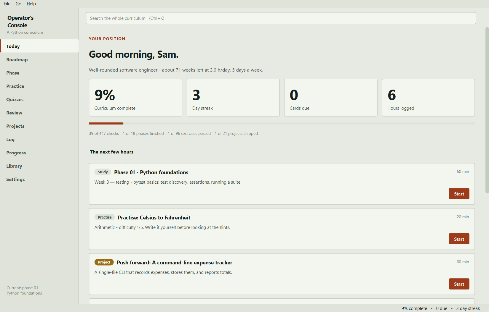

# Operator's Console

A desktop app that teaches Python from nothing to production engineering, and
keeps you honest about how far you have actually got.

It is not a video course and not a tutorial list. It is a curriculum with a
position marker, graded exercises that run your real code, projects with
acceptance criteria, and a spaced-repetition deck so that phase 1 does not leak
away while you are busy with phase 9.



## What is in it

| | |
|---|---|
| **21 phases** | From setting up Git to systems internals, ordered so nothing asks you to use something you have not been taught |
| **536 tracked steps** | 435 study steps plus 101 gate checks. Every phase ends with a gate you prove rather than read, and your chosen track decides how many apply to you |
| **96 graded exercises** | 430 individual checks. You write Python, the app runs it in a separate process and tells you exactly which check failed |
| **167 review questions** | Multiple choice with an explanation for every answer, scheduled by FSRS-6 |
| **22 projects** | 130 requirements between them, plus stretch goals and a rubric for what "finished" means |
| **9 tracks** | Backend, data, AI, automation, DevOps, security, interview prep, or the full spine |
| **30 fields, 24 certificates, 7 shelves** | An opinionated library, with a note on why each thing is worth your time |

## How it works

**Today** answers one question: what should the next hour look like? Follow it
and you can ignore every other page.

**Roadmap** is your plan. It is reordered around the track and goals you pick,
and it explains why each phase is where it is. Nothing is ever locked — if you
already know a topic, do the gate and move on.

**Practice** is the part that makes the difference. Exercises run in a separate
process with a timeout, so an endless loop kills the child and not your work.
Hints are laddered, the solution is available, and revealing it is recorded.

**Review** uses FSRS-6, the algorithm Anki adopted as its default. Anything you
get wrong in a quiz is scheduled automatically. Daily limits stop a week away
from turning into an unopenable backlog.

**Projects** are the proof. A phase is not finished because you read it.

Anything you change by accident can be taken back. Undo and redo sit next to the
search box and work from any page, across ticked lines, project status,
certificates and self-assessments, with `Ctrl+Z` and `Ctrl+Shift+Z`.

**Log** and **Progress** are the honest mirror: hours, streaks, review accuracy,
and the gap between what you rated yourself and what the exercises say.

Everything saves the moment you change it. There is no save button, no account,
and your progress is a single SQLite file on your machine.

The app makes one kind of network request and no other: once a day it asks
GitHub whether a newer version exists, so it can offer a one-click update. It
downloads nothing until you press the button, and the check can be turned off
in Settings. Updating never touches your progress — the database lives in a
separate folder, and the updater refuses to run if it would overwrite it.

## Install

One line, on any platform. Both scripts fetch the latest release from GitHub,
install it for the current user only, and never ask for a password.

**Windows** — open PowerShell and paste:

```powershell
irm https://raw.githubusercontent.com/Luneswan/operators-console/main/install.ps1 | iex
```

**macOS or Linux** — open a terminal and paste:

```bash
curl -fsSL https://raw.githubusercontent.com/Luneswan/operators-console/main/install.sh | sh
```

Prefer to click things? Every build is on the
[releases page](https://github.com/Luneswan/operators-console/releases):

| You are on | Download | Then |
|---|---|---|
| Windows | `...-windows-setup.exe` | Run it. No admin prompt. |
| Windows, no install | `...-windows-portable.zip` | Unzip, run `operators-console.exe`. |
| macOS (Apple silicon) | `...-macos-arm64.dmg` | Drag to Applications. |
| macOS (Intel) | `...-macos-x86_64.dmg` | Drag to Applications. |
| Linux | `...-x86_64.AppImage` | `chmod +x` it, then run it. |
| Debian, Ubuntu | `..._amd64.deb` | `sudo apt install ./the-file.deb` |

### The first-launch warning

The builds are not code-signed, because a certificate costs a few hundred
pounds a year and this is free software. That is the only reason your machine
complains, and it complains exactly once:

* **Windows** — SmartScreen appears. Click **More info**, then **Run anyway**.
* **macOS** — a double-click is refused. **Right-click the app → Open** instead,
  and confirm. The `install.sh` one-liner clears the quarantine flag for you, so
  it does not happen at all if you install that way.

### From source, any platform

```bash
pip install operators-console
operators-console
```

Python 3.11 or newer. The only dependency is PySide6.

## Where your data lives

One folder, so backing up is a copy:

| Platform | Location |
|---|---|
| Windows | `%APPDATA%\Operator's Console` |
| macOS | `~/Library/Application Support/Operator's Console` |
| Linux | `~/.local/share/operators-console` |

It holds `progress.db`, a `backups/` folder the app rotates for you, and a
`workspace/` scratch directory the exercise runner uses. **Settings → Export
backup** writes a single JSON file you can restore on another machine, and
**Export report** writes a Markdown summary you can hand to a mentor.

Set `OPERATORS_CONSOLE_HOME` to put all of it somewhere else — useful for a
portable install on a USB stick.

## Keyboard

| | |
|---|---|
| `Ctrl+1` … `Ctrl+9` | Jump to a page |
| `Ctrl+K` | Search the whole curriculum |
| `Ctrl+Z` / `Ctrl+Shift+Z` | Undo or redo the last change |
| `Ctrl+Enter` | Run the current exercise |
| `Tab` / `Shift+Tab` | Indent or outdent the selection in the editor |

## Building it yourself

```bash
git clone <this repository>
cd python-operators-console
python -m venv .venv && . .venv/bin/activate     # .venv\Scripts\activate on Windows
pip install -e ".[dev,build]"

python -m operators_console          # run from source
python -m pytest                     # the full suite, including the exercise bank
python -m pytest -m "not slow"       # skip the 192 grader runs
```

To produce a distributable build for whichever platform you are on:

```bash
python packaging/build.py --installer
```

That writes a frozen application to `dist/`, then:

* **Windows** — an Inno Setup installer, if `ISCC.exe` is installed
* **macOS** — a `.dmg`, via `hdiutil`
* **Linux** — a `.tar.gz` and a `.deb`; run `packaging/linux/build-appimage.sh`
  for the AppImage

Each platform's artefacts must be built on that platform; there is no
cross-compilation.

## How the code is arranged

```
src/operators_console/
  core/          no Qt imports anywhere in here
    curriculum.py  loads the bundled content into immutable objects
    storage.py     SQLite, one commit per change, versioned schema
    srs.py         FSRS-6 scheduler
    progress.py    checkmarks to percentages
    adaptive.py    track and goals to an ordered roadmap
    today.py       the daily action list
    review.py      what enters the deck and when
    runner.py      grades a submission in a separate process
    search.py      one index over the whole course
    export.py      backup, restore and the Markdown report
  data/          curriculum.json, exercises.json, projects.json, tracks.json
  ui/            everything Qt
tests/           120 tests, including every shipped solution
build_tools/     regenerates the content bundles from source material
packaging/       icons, PyInstaller spec, installers
```

The split matters: `core` has no Qt dependency, so the whole model is testable
without a display, and the UI layer holds no logic worth testing separately.

## Adding or changing content

The bundles under `src/operators_console/data/` are generated. Edit the authoring
files in `build_tools/` and regenerate:

```bash
cd build_tools
python build_exercises.py     # rebuilds exercises.json
python build_projects.py      # rebuilds projects.json
python verify_exercises.py    # every solution must pass, no starter may
```

`verify_exercises.py` is the gate that matters. An exercise whose own solution
fails is a bug in the course, and a learner would read it as their mistake.

## Design notes

**Why a native app rather than a web page.** The exercise runner needs to
execute arbitrary Python with a real timeout and a real kill. Progress that
lives in `localStorage` is one cleared cache away from gone.

**Why FSRS rather than SM-2.** Benchmarks over hundreds of millions of Anki
reviews put FSRS 20–30% ahead for the same retention. The implementation in
`core/srs.py` follows the published FSRS-6 specification, with the default
weights from the reference implementation.

**Why nothing is locked.** Prerequisites are shown, not enforced. People arrive
with uneven knowledge, and an app that refuses to let you skip what you already
know gets abandoned rather than obeyed.

**Why the checkboxes are not the score.** Coverage and retention are different
things, so the Progress page reports both, side by side, including the cases
where your self-assessment and your exercise results disagree.

## Licence

MIT. See `LICENSE`.

The curriculum links to third-party courses, books and documentation; those
remain the property of their authors.
