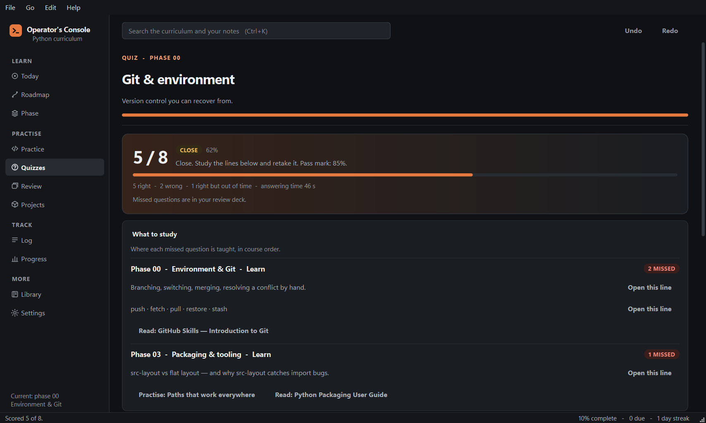

# Operator's Console

A desktop app for learning Python, from first program to production
engineering. It combines a curriculum with progress tracking, exercises graded
by running your code, timed quizzes, projects with acceptance criteria, and a
spaced-repetition review deck. It runs offline; your progress is a local SQLite
file.


## Contents

| | |
|---|---|
| **21 phases** | From Git setup to systems internals, in teaching order |
| **536 tracked steps** | 435 study steps plus 101 gate checks. Each study phase ends with a gate. Your track decides which phases apply |
| **119 graded exercises** | 626 individual checks. Your code runs in a separate process; each failed check reports the value returned, the value expected, and where they differ |
| **242 quiz questions** | In 20 quizzes. Timed per question, reshuffled per attempt, each linked to the checklist line that teaches it. Wrong answers are scheduled for review with FSRS-6 |
| **22 projects** | 130 requirements between them, plus stretch goals and a rubric |
| **9 tracks** | Well-rounded engineer, Python only, backend, data, AI, automation, DevOps, security, or job-ready by the fastest route |
| **30 fields, 24 certificates, 7 shelves** | A reading list with a one-line note per entry |

## Features

**Today.** The next actions: due reviews, the next exercise, gate checks left,
weak quizzes, and older phases to revisit.

**Roadmap.** Your plan as a timeline, ordered by the track and goals you choose
at setup. No phase is locked.

**Phases.** Each phase has a checklist, optional stretch sections, a gate, a
reading list and notes. A phase counts as **proven** when its gate is ticked,
its quiz is passed at 85% or better, at least 60% of its exercises pass, and
its project is shipped where it has one.

**Practice.** Exercises run in a child process with a 10-second timeout
(configurable) and a 1 GiB memory cap; you can stop a run. Each exercise shows
worked examples taken from its checks. Errors that stop the file before any
check runs are explained in plain words. Hints end with the solution's
structure with expressions removed. Reading the solution is recorded, and the
list marks exercises solved after reading it.

**Quizzes.** One per phase. Question order, answer order and the letter of the
correct answer change on every attempt. Each question has a countdown sized to
its length; an answer after it scores zero. Results list the checklist lines
that teach each missed question, with links to them, an unpassed exercise and a
reading for each phase, and a practice round of the missed questions.

**Review.** FSRS-6 spaced repetition. Quiz misses, gate checks and lines you
add from a phase become cards. Default limits: 15 new cards and 120 reviews a
day, 90% target retention. Keys: `Space` or `Enter` to reveal or check, `A`–`D`
to choose, `1`–`4` to rate, `S` to skip. You can bury a card and undo a rating.

**Projects.** Requirements, stretch goals and a rubric for each project.

**Log and Progress.** Hours, streaks, review accuracy, per-phase coverage and
scores, and your self-ratings next to your exercise results.

**Library.** Fields, certificates, books and channels. Optional groups show one
recommended resource and fold the rest.

**Search.** `Ctrl+K` searches the curriculum, exercises, projects, the library,
your notes and your log.

**Undo.** `Ctrl+Z` and `Ctrl+Shift+Z` (or `Ctrl+Y`) from any page. Covers ticked
lines, project and certificate status, self-ratings, log entries, review ratings
and buried cards. History is kept in memory until the app closes.

**Snapshots.** One a day, and one before every reset, import or upgrade. The
last 7 daily and 12 other snapshots are kept. **Settings → Restore a snapshot**
restores one, taking a snapshot of the current state first.

**Single instance.** Launching the app again brings the open window to the
front. A portable install with its own `OPERATORS_CONSOLE_HOME` is a separate
instance.

**Network.** The only request the app makes is the update check against the
GitHub releases API: at start, every five minutes while open, and when the
window regains focus. It sends the last ETag, so unchanged answers are
`304 Not Modified` and do not count against GitHub's rate limit. Nothing is
downloaded until you press **Update**. The check can be turned off in Settings.

## Screenshots

| | |
|---|---|
|  |  |
|  |  |
|  |  |

## Install

The install scripts download the latest release, verify it against the
release's `SHA256SUMS`, and install for the current user. No administrator
rights are needed.

Windows (PowerShell):

```powershell
irm https://raw.githubusercontent.com/Luneswan/operators-console/main/install.ps1 | iex
```

macOS or Linux:

```bash
curl -fsSL https://raw.githubusercontent.com/Luneswan/operators-console/main/install.sh | sh
```

Manual downloads are on the
[releases page](https://github.com/Luneswan/operators-console/releases):

| Platform | File | Install |
|---|---|---|
| Windows | `...-windows-setup.exe` | Run it |
| Windows, portable | `...-windows-x64-portable.zip` | Unzip, run `operators-console.exe` |
| macOS, Apple silicon | `...-macos-arm64.dmg` | Drag to Applications |
| macOS, Intel | `...-macos-x86_64.dmg` | Drag to Applications |
| Linux | `...-x86_64.AppImage` | `chmod +x`, then run |
| Debian, Ubuntu | `..._amd64.deb` | `sudo apt install ./the-file.deb` |
| Linux, portable | `...-linux-x86_64.tar.gz` | Unpack, run `operators-console` |

From source (Python 3.11 or newer; the only dependency is PySide6):

```bash
pip install operators-console
operators-console
```

### First launch

The builds are not code-signed.

* Windows: SmartScreen appears. Click **More info**, then **Run anyway**.
* macOS: right-click the app, choose **Open**, and confirm. `install.sh`
  removes the quarantine flag, so this step is not needed after a scripted
  install.

## Updating

When a release is available, an **Update** button appears in the sidebar. It
downloads the release, verifies the checksum, installs it and reopens the app
on the page you were on. Running an install script again also updates.

1.0.1 and later update in-app. Two older builds cannot:

* **1.0.0** has no update check.
* **1.0.x portable (Windows)** is not offered updates, because its updater can
  damage its own folder.

For these, or after a failed update, run the force-update command below once.
Later versions then update in-app.

### Force an update

Reinstalls the latest release over any installed version. It closes the app
(force-stopping it after 20 seconds), verifies the download against
`SHA256SUMS`, and replaces only the program files. Progress, notes, the review
deck and settings are stored separately and are not touched.

Windows, installed:

```powershell
irm https://raw.githubusercontent.com/Luneswan/operators-console/main/install.ps1 | iex
```

Windows, portable:

```powershell
& ([scriptblock]::Create((irm https://raw.githubusercontent.com/Luneswan/operators-console/main/install.ps1))) -Portable
```

macOS or Linux:

```bash
curl -fsSL https://raw.githubusercontent.com/Luneswan/operators-console/main/install.sh | sh
```

## Data

| Platform | Folder |
|---|---|
| Windows | `%APPDATA%\Operator's Console` |
| macOS | `~/Library/Application Support/Operator's Console` |
| Linux | `~/.local/share/operators-console` |

Contents:

* `progress.db`: all progress, as SQLite
* `backups/`: rotated snapshots
* `workspace/`: scratch directory for the exercise runner
* `updates/`: downloads during an update; emptied afterwards

Set `OPERATORS_CONSOLE_HOME` to use another folder. **Settings → Export
backup** writes a JSON backup that **Import backup** restores on any machine.
**Export report** writes a Markdown summary. Settings can also copy an export
and the latest snapshot to a second folder, such as another drive.

## Keyboard

| Keys | Action |
|---|---|
| `Ctrl+1` … `Ctrl+9` | Open a page, in sidebar order |
| `Ctrl+0` / `Ctrl+L` | Library |
| `Ctrl+,` | Settings |
| `Ctrl+K` | Search |
| `Ctrl+Z` | Undo |
| `Ctrl+Shift+Z` / `Ctrl+Y` | Redo |
| `F1` | List all shortcuts |
| `Ctrl+Enter` | Run the current exercise |
| `Ctrl+/` | Comment or uncomment the selected lines |
| `Tab` / `Shift+Tab` | Indent or outdent the selection |
| `A`–`D`, `Enter` | Choose and check a quiz answer |
| `Space`, `A`–`D`, `1`–`4`, `S` | Reveal, choose, rate and skip in Review |

Focus rings show only when navigating with the keyboard.

## Development

```bash
git clone https://github.com/Luneswan/operators-console.git
cd operators-console
python -m venv .venv && . .venv/bin/activate     # .venv\Scripts\activate on Windows
pip install -e ".[dev,build]"

python -m operators_console          # run from source
python -m pytest                     # full suite, including every exercise solution
python -m pytest -m "not slow"       # skip grading every solution
python -m pytest -m walk             # UI walkthrough; writes docs/WALKTHROUGH.md
ruff check .                         # lint
```

CI runs the suite on Python 3.11 and 3.13 on Windows, macOS and Linux.

### Building

```bash
python packaging/build.py --installer
```

Writes a PyInstaller build and a portable archive to `dist/`, plus:

* Windows: an Inno Setup installer. Requires Inno Setup 6; the build fails if
  `ISCC.exe` is missing.
* macOS: a `.dmg`, built with `hdiutil`.
* Linux: a `.tar.gz` and a `.deb`. `packaging/linux/build-appimage.sh` builds
  the AppImage.

Each platform must be built on that platform.

### Releasing

Pushing a `v*` tag runs `.github/workflows/build.yml`. The tag must match
`src/operators_console/version.py`. The release job checks that every expected
file is present (`python packaging/build.py --check-release DIR --tag vX.Y.Z`),
publishes `SHA256SUMS`, and uses `.github/RELEASE_NOTES.md` as the release body.
Changes per version are in `CHANGELOG.md`.

## Code layout

```
src/operators_console/
  app.py         start-up, single-instance lock
  core/          no Qt imports
    models.py        immutable course objects
    curriculum.py    loads the bundled content
    storage.py       SQLite store, versioned schema, snapshots
    history.py       undo and redo
    srs.py           FSRS-6 scheduler
    progress.py      reading progress and phase proof
    adaptive.py      track and goals to an ordered roadmap
    today.py         the daily action list
    review.py        review deck contents and scheduling
    quiz_session.py  quiz timers, layouts and the study plan
    runner.py        grades a submission in a child process
    load_errors.py   explains errors raised while loading a submission
    exercise_brief.py  worked examples, check description, answer shape
    textmatch.py     text matching for search and filters
    search.py        search index over course content and your notes
    export.py        backup, restore and the Markdown report
    paths.py         data folder location
    updates.py       release lookup, verification and installation
  data/          curriculum.json, exercises.json, projects.json, tracks.json
  ui/            Qt: main window, pages (views/), widgets, theme,
                 focus rings, shortcuts, snapshots dialog, updater
tests/           unit and integration tests; tests/walkthrough/ drives the UI
build_tools/     generates the content bundles
packaging/       icons, PyInstaller spec, installers, release check
docs/            plan, audits, UI standards, walkthrough report
```

`core` does not import Qt, so the model is tested without a display.

## Content

The files in `src/operators_console/data/` are generated. Edit the sources in
`build_tools/` and regenerate:

```bash
python build_tools/transform.py      # curriculum.json from raw_curriculum.json
cd build_tools
python build_exercises.py            # exercises.json
python build_projects.py             # projects.json
python verify_exercises.py           # every solution passes; no starter passes
```

| Source | Contents |
|---|---|
| `raw_curriculum.json` | phases, checklists, gates, quizzes, library |
| `resource_picks.json` | the recommended resource in each optional group |
| `quiz_teaches.json` | the checklist line each quiz question tests |
| `ex_*.py` | exercises: prompt, starter, checks, hints, solution |
| `hint_rewrites.json`, `prompt_edits.json` | wording overrides for exercises |
| `proj_*.py`, `project_edits.json` | projects and wording overrides |

Quiz question ids are positional, and review history is keyed on them: append
new questions, do not reorder or delete them.

## Design decisions

* **Native app.** The exercise runner needs a real process with a timeout and a
  kill, and progress should not depend on browser storage.
* **FSRS instead of SM-2.** FSRS needs fewer reviews for the same retention in
  published benchmarks. `core/srs.py` implements FSRS-6 with the reference
  default weights.
* **No locked phases.** Prerequisites are shown, not enforced.
* **Coverage and results are separate.** Ticked lines measure coverage;
  exercises, quizzes and reviews measure retention. Progress shows both.

## Licence

MIT. See `LICENSE`. Linked third-party courses, books and documentation belong
to their authors.
