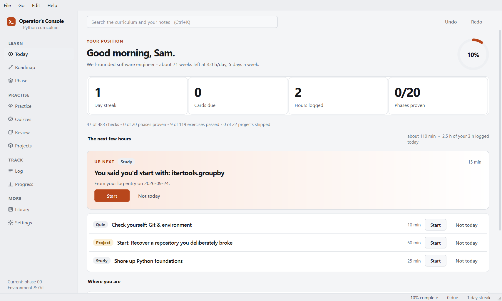
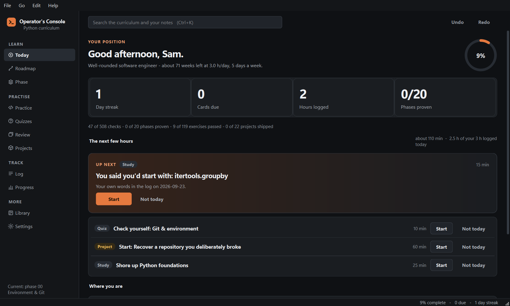
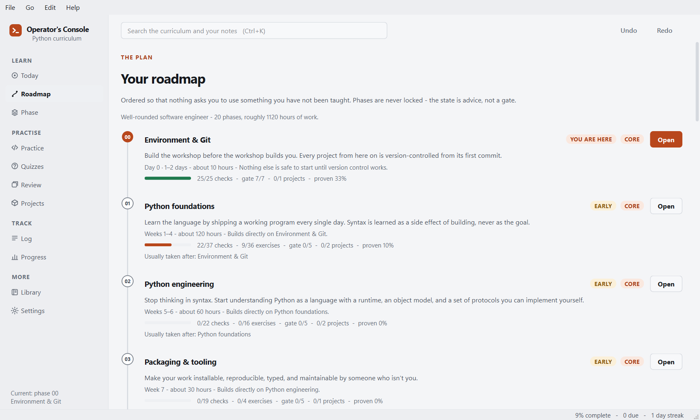
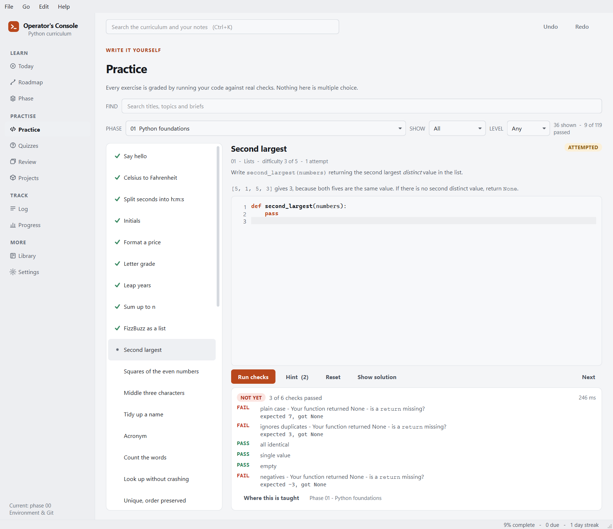
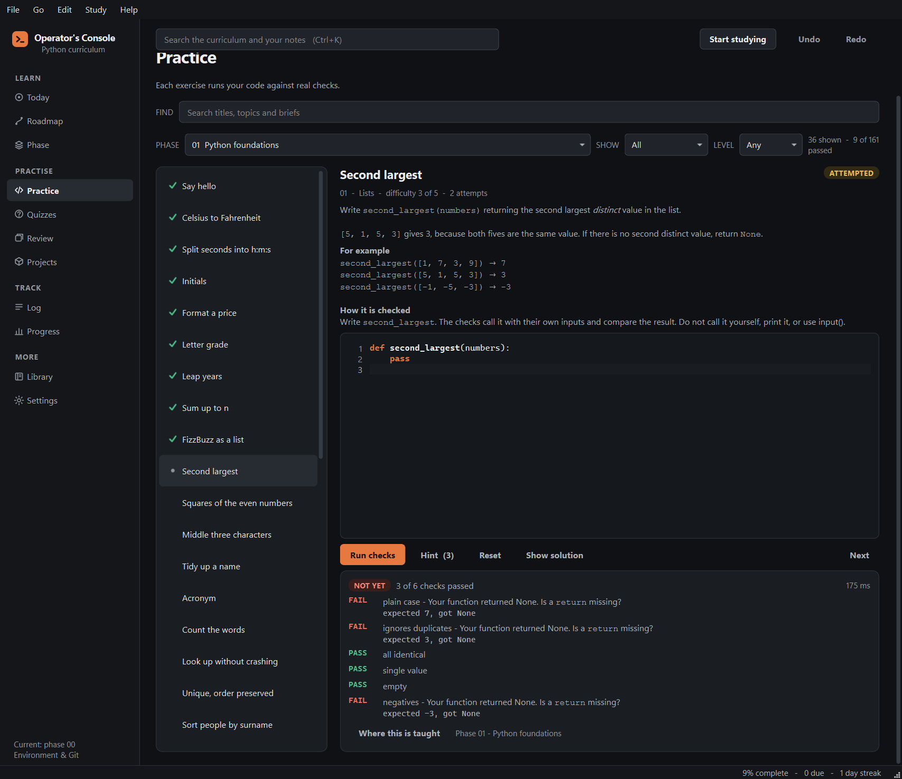
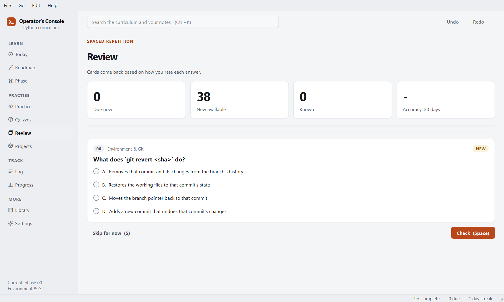

# Operator's Console

A desktop app that teaches Python from nothing to production engineering, and
keeps you honest about how far you have actually got.

It is not a video course and not a tutorial list. It is a curriculum with a
position marker, graded exercises that run your real code, projects with
acceptance criteria, and a spaced-repetition deck so that phase 1 does not leak
away while you are busy with phase 9.



## What is in it

| | |
|---|---|
| **21 phases** | From setting up Git to systems internals, ordered so nothing asks you to use something you have not been taught |
| **536 tracked steps** | 435 study steps plus 101 gate checks. Every study phase ends with a gate you prove rather than read, and your chosen track decides how many apply to you |
| **119 graded exercises** | 626 individual checks. You write Python, the app runs it in a separate process and tells you which check failed, what your code returned, what was expected and why they differ |
| **242 quiz questions** | In 20 quizzes. Multiple choice with an explanation, and anything you get wrong is scheduled for review by FSRS-6 |
| **22 projects** | 130 requirements between them, plus stretch goals and a rubric for what "finished" means |
| **9 tracks** | A well-rounded engineer, Python for its own sake, backend, data, AI, automation, DevOps, security, or job-ready in the shortest honest time |
| **30 fields, 24 certificates, 7 shelves** | An opinionated library, with a note on why each thing is worth your time |

## How it works

**Today** answers one question: what should the next hour look like? Follow it
and you can ignore every other page.

**Roadmap** is your plan, drawn as a timeline. It is reordered around the track
and goals you pick, and it explains why each phase is where it is. Nothing is
ever locked — if you already know a topic, prove it and move on.

A phase counts as finished when it is **proven**, not when it is read: its gate
is ticked, its quiz is passed at 85% or better, at least 60% of its exercises
pass, and a project is shipped where the phase has one. Ticked lines show as
reading progress beside that, and each phase says in plain words what is still
missing. The gate checks also come back as review cards, so the "do this from
memory" lines are asked again rather than read once.

**Practice** is the part that makes the difference. Exercises run in a separate
process with a timeout and a memory cap, so an endless loop kills the child and
not your work, and you can stop a run yourself. A failed check says why: the
value you returned, the value expected, and where they differ. Hints are
laddered and the solution is always available — revealing it is recorded, and
the list marks the exercises you solved after reading the answer, so the score
you see is the score you earned. The list filters by text, difficulty and
status.

**Quizzes** check each phase. A wrong answer is explained, and the question
goes into your review deck.

**Review** uses FSRS-6, the algorithm Anki adopted as its default. Anything you
get wrong in a quiz is scheduled automatically. Daily limits stop a week away
from turning into an unopenable backlog. Every action has a key, printed on its
button: Space or Enter to reveal, A to D to choose, 1 to 4 to rate, S to skip.
You can bury a card, and undo the rating you just gave.

**Projects** are the proof. A phase is not finished because you read it.

Undo and redo sit next to the search box and work from any page, with `Ctrl+Z`
and `Ctrl+Shift+Z` or `Ctrl+Y`. They cover everything one careless click can
change: ticked lines, project status, certificate status, self-assessment
ratings, log entries you added, edited or deleted, a review rating, and a card
you buried. The history lives in memory, so it goes when you close the app —
what you typed is already saved, and a snapshot is what brings back a whole day.
The app takes one snapshot a day by itself, and one before every reset, import
or upgrade; **Settings → Restore a snapshot** lists them, and restoring one takes
a snapshot of the present first, so even a restore can be undone.

**Log** and **Progress** are the honest mirror: hours, streaks, review accuracy,
and the gap between what you rated yourself and what the exercises say. The Log
filters by text and date and keeps every note you have written in one place.

**Library** is the reading list: fields, certificates and a shelf of books and
channels, each with a note on why it is worth your time. Where a group is
optional, the single best resource is shown and the rest are folded under
"N more to study". `Ctrl+K` searches all of it, the whole curriculum, and your
own notes and log entries.

Everything saves the moment you change it. There is no save button, no account,
and your progress is a single SQLite file on your machine. One copy of the app
owns that file at a time: launch it again and the window you already have comes
to the front instead of a second copy opening behind it, because two copies
writing to one database means the older one silently overwrites what the newer
one just saved. A portable install pointed at its own `OPERATORS_CONSOLE_HOME`
is a separate app and may run alongside.

The app makes one kind of network request and no other: it asks GitHub whether
a newer version exists — when it starts, every five minutes while it is open,
and when you switch back to it — so a new release shows up within minutes and
it can offer a one-click update. Unchanged answers are free: the app sends the
last ETag and GitHub replies `304 Not Modified`, which does not count against
its rate limit. It downloads nothing until you
press the button, the first-run setup asks before it is ever turned on, and it
can be turned off in Settings at any time. Updating never touches your progress
— the database lives in a separate folder, and the updater refuses to run if it
would overwrite it.

## Screenshots

| | |
|---|---|
|  |  |
|  |  |
|  | |

## Install

One line, on any platform. Both scripts fetch the latest release from GitHub,
install it for the current user only, and never ask for a password.

**Windows** — open PowerShell and paste:

```powershell
irm https://raw.githubusercontent.com/Luneswan/operators-console/main/install.ps1 | iex
```

**macOS or Linux** — open a terminal and paste:

```bash
curl -fsSL https://raw.githubusercontent.com/Luneswan/operators-console/main/install.sh | sh
```

Prefer to click things? Every build is on the
[releases page](https://github.com/Luneswan/operators-console/releases):

| You are on | Download | Then |
|---|---|---|
| Windows | `...-windows-setup.exe` | Run it. No admin prompt. |
| Windows, no install | `...-windows-x64-portable.zip` | Unzip, run `operators-console.exe`. |
| macOS (Apple silicon) | `...-macos-arm64.dmg` | Drag to Applications. |
| macOS (Intel) | `...-macos-x86_64.dmg` | Drag to Applications. |
| Linux | `...-x86_64.AppImage` | `chmod +x` it, then run it. |
| Debian, Ubuntu | `..._amd64.deb` | `sudo apt install ./the-file.deb` |
| Linux, no install | `...-linux-x86_64.tar.gz` | Unpack, run `operators-console`. |

Every file is listed in the release's `SHA256SUMS`. Both one-line installers and
the in-app update check each download against it and refuse anything that does
not match.

### Updating

When a new version is out, a button appears in the sidebar. One click downloads
it, checks it, installs it and reopens the app on the page you were on. Running
either one-line installer again does the same.

Coming from 1.0.x on Windows, the in-app update works too. If the old version
ever reopens after updating, close it and run the `...-windows-setup.exe` once.
A 1.0.x *portable* build will say there is no download for your platform; that
is deliberate, because its updater could damage its own folder. Use the portable
command under [Force an update](#force-an-update-keeps-your-progress) instead.
1.0.0 predates the update check entirely, so it needs that command once too.

### Force an update (keeps your progress)

This reinstalls the newest release over whatever you have, from any version,
including 1.0.0. It closes the app if it is open (and stops it if it will not
close), checks the download against `SHA256SUMS`, and replaces only the program.
Your progress, notes, review deck and settings live in a separate folder, which
installing, updating and uninstalling never touch:
`%APPDATA%\Operator's Console` on Windows, `~/Library/Application Support/Operator's Console`
on macOS, `~/.local/share/operators-console` on Linux.

**Windows, installed** (the usual case) — paste into PowerShell:

```powershell
irm https://raw.githubusercontent.com/Luneswan/operators-console/main/install.ps1 | iex
```

**Windows, portable zip** — paste into PowerShell:

```powershell
& ([scriptblock]::Create((irm https://raw.githubusercontent.com/Luneswan/operators-console/main/install.ps1))) -Portable
```

**macOS or Linux** — paste into a terminal:

```bash
curl -fsSL https://raw.githubusercontent.com/Luneswan/operators-console/main/install.sh | sh
```

Use this if:

* you are on **1.0.0** — the first release has no update check at all, so it
  can never show the button; run the command once and every later version
  updates itself;
* you are on a **1.0.x portable** Windows build — its own updater could damage
  its folder, so it is deliberately not offered the update;
* an update ever failed, or you just want a clean reinstall.

### The first-launch warning

The builds are not code-signed, because a certificate costs a few hundred
pounds a year and this is free software. That is the only reason your machine
complains, and it complains exactly once:

* **Windows** — SmartScreen appears. Click **More info**, then **Run anyway**.
* **macOS** — a double-click is refused. **Right-click the app → Open** instead,
  and confirm. The `install.sh` one-liner clears the quarantine flag for you, so
  it does not happen at all if you install that way.

### From source, any platform

```bash
pip install operators-console
operators-console
```

Python 3.11 or newer. The only dependency is PySide6.

## Where your data lives

One folder, so backing up is a copy:

| Platform | Location |
|---|---|
| Windows | `%APPDATA%\Operator's Console` |
| macOS | `~/Library/Application Support/Operator's Console` |
| Linux | `~/.local/share/operators-console` |

It holds `progress.db`, a `backups/` folder of snapshots the app rotates for you
(seven daily ones and twelve others), a `workspace/` scratch directory the
exercise runner uses, and an `updates/` folder an update downloads into and
clears afterwards. **Settings → Export
backup** writes a single JSON file you can restore on another machine, and
**Export report** writes a Markdown summary you can hand to a mentor.

Set `OPERATORS_CONSOLE_HOME` to put all of it somewhere else — useful for a
portable install on a USB stick.

## Keyboard

| | |
|---|---|
| `Ctrl+1` … `Ctrl+9` | Jump to a page, Today to Progress, in sidebar order |
| `Ctrl+0` / `Ctrl+L` | Library (the tenth page) |
| `Ctrl+,` | Settings |
| `Ctrl+K` | Search the curriculum and your own notes |
| `Ctrl+Z` | Undo the last change |
| `Ctrl+Shift+Z` / `Ctrl+Y` | Redo |
| `F1` | The full list of shortcuts, built from the live menus |
| `Ctrl+Enter` | Run the current exercise |
| `Ctrl+/` | Comment or uncomment the selected lines in the editor |
| `Tab` / `Shift+Tab` | Indent or outdent the selection in the editor |
| `Space`, `A`–`D`, `1`–`4`, `S` | Reveal, choose, rate and skip in Review |

Focus rings appear when you move with the keyboard, not when you click.

## Building it yourself

```bash
git clone <this repository>
cd python-operators-console
python -m venv .venv && . .venv/bin/activate     # .venv\Scripts\activate on Windows
pip install -e ".[dev,build]"

python -m operators_console          # run from source
python -m pytest                     # the full suite, including the exercise bank
python -m pytest -m "not slow"       # skip the grader runs over every solution
python -m pytest -m walk             # the learner walkthrough; writes docs/WALKTHROUGH.md
ruff check .                         # lint, as CI runs it
```

To produce a distributable build for whichever platform you are on:

```bash
python packaging/build.py --installer
```

That writes a frozen application and a portable zip to `dist/`, then:

* **Windows** — an Inno Setup installer. Install Inno Setup 6 first: the build
  stops with an error if `ISCC.exe` cannot be found, rather than leaving the
  installer out
* **macOS** — a `.dmg`, via `hdiutil`
* **Linux** — a `.tar.gz` and a `.deb`; run `packaging/linux/build-appimage.sh`
  for the AppImage

Releases are built by `.github/workflows/build.yml` when a `v*` tag is pushed.
The tag must match `src/operators_console/version.py`; the release job checks
that, checks every expected file is present by name
(`python packaging/build.py --check-release DIR --tag vX.Y.Z`), and publishes
`SHA256SUMS` beside them. What changed in each version is in `CHANGELOG.md`.

Each platform's artefacts must be built on that platform; there is no
cross-compilation.

## How the code is arranged

```
src/operators_console/
  app.py         start-up, and one copy per data folder
  core/          no Qt imports anywhere in here
    models.py      the immutable course objects
    curriculum.py  loads the bundled content into them
    storage.py     SQLite, one commit per change, versioned schema, snapshots
    history.py     undo and redo
    srs.py         FSRS-6 scheduler
    progress.py    reading progress, and what a phase needs to count as proven
    adaptive.py    track and goals to an ordered roadmap
    today.py       the daily action list
    review.py      what enters the deck and when
    runner.py      grades a submission in a separate process, explains failures
    textmatch.py   text matching for search and filters
    search.py      one index over the course and your own writing
    export.py      backup, restore and the Markdown report
    paths.py       where the data folder is
    updates.py     finding, checking and applying a new version
  data/          curriculum.json, exercises.json, projects.json, tracks.json
  ui/            everything Qt: the window, the pages in views/, widgets/,
                 the theme, focus rings, shortcuts, snapshots and the updater
tests/           over 1,000 tests, including every shipped solution;
                 tests/walkthrough/ drives the whole interface as a learner
build_tools/     regenerates the content bundles from source material
packaging/       icons, PyInstaller spec, installers, the release check
docs/            the plan, audits, UI standards and the walkthrough report
```

The split matters: `core` has no Qt dependency, so the whole model is testable
without a display, and the UI layer holds no logic worth testing separately.

## Adding or changing content

The bundles under `src/operators_console/data/` are generated. Edit the authoring
files in `build_tools/` and regenerate:

```bash
cd build_tools
python build_exercises.py     # rebuilds exercises.json
python build_projects.py      # rebuilds projects.json
python verify_exercises.py    # every solution must pass, no starter may
```

`verify_exercises.py` is the gate that matters. An exercise whose own solution
fails is a bug in the course, and a learner would read it as their mistake.

## Design notes

**Why a native app rather than a web page.** The exercise runner needs to
execute arbitrary Python with a real timeout and a real kill. Progress that
lives in `localStorage` is one cleared cache away from gone.

**Why FSRS rather than SM-2.** Benchmarks over hundreds of millions of Anki
reviews put FSRS 20–30% ahead for the same retention. The implementation in
`core/srs.py` follows the published FSRS-6 specification, with the default
weights from the reference implementation.

**Why nothing is locked.** Prerequisites are shown, not enforced. People arrive
with uneven knowledge, and an app that refuses to let you skip what you already
know gets abandoned rather than obeyed.

**Why the checkboxes are not the score.** Coverage and retention are different
things, so the Progress page reports both, side by side, including the cases
where your self-assessment and your exercise results disagree.

## Licence

MIT. See `LICENSE`.

The curriculum links to third-party courses, books and documentation; those
remain the property of their authors.
